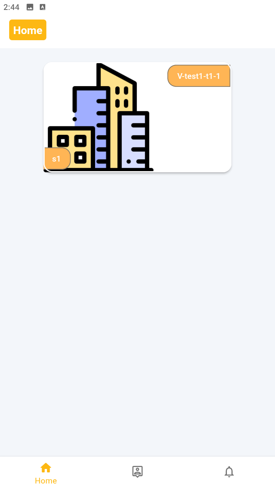
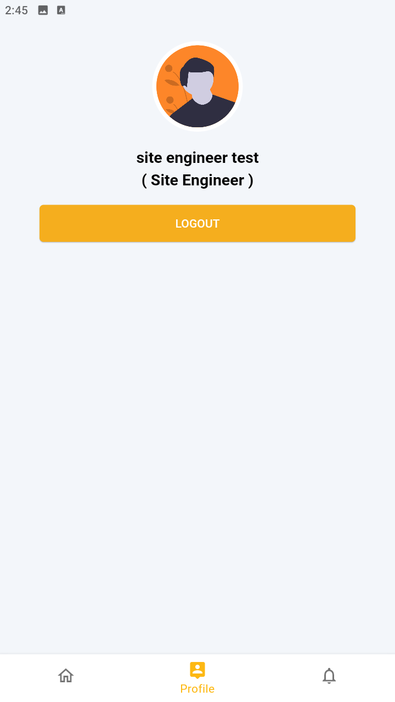
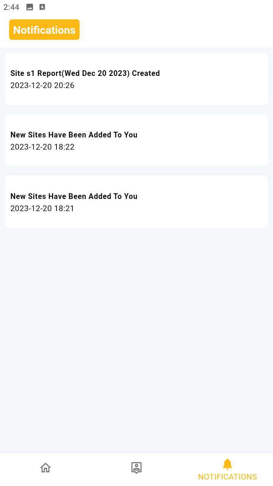

#مهندس موقع

## 🏹 الأهداف

الحفاظ على الاتصال بين مهندسي الموقع والمكتب الفني.

## 💪 الوظائف التي نريد تغطيتها

* مواقع تقارير العمل اليومي
* تتبع المعاملات المادية للمواقع والطلبات والمخزون
* الانتهاء من عمل الموقع كمستندات لإضافتها إلى تخليص المشروع

* * *

## 📱 شاشات التطبيقات

بعد تسجيل الدخول كمهندس الموقع

<!--  |
 |
 -->
### متابعة شاشة الموقع

بعد النقر على الموقع الذي نريد متابعته من الشاشة الرئيسية، ستظهر شاشة جديدة بالخيارات التالية:

1. التقرير اليومي الجديد (إنشاء تقرير العمل اليومي للموقع).
2. سجل التقارير اليومية (تتبع تقارير العمل والاطلاع على تفاصيلها).
3. مركز المستودعات (موقع تتبع المستودعات).س
4. تطهير الموقع. (تتبع وإنشاء تقارير العمل النهائية للموقع).

### التقرير اليومي الجديد:

وهنا يمكننا إبلاغ الموقع بالعمل إلى المكتب الفني لمراجعته.

لإنشاء التقرير اليومي يجب القيام بثلاث خطوات:

<ul>

 **املأ تفاصيل التقرير**: 
     في هذه الخطوة نحتاج إلى تحديد 
     **تاريخ التقرير** . 
     **حالة الموقع** في هذا اليوم (عمل)، إيقاف (قليل من العمل أو متوقف)، عطلة (إجازة). 
     **سبب**
     إذا كانت الحالة معطلة، فيجب تقديم السبب.
     في حالة العطلة أو في ذلك ليس من الضروري تقديمه ويستخدم كملاحظة. 
     **المسبب:** (حالة إيقاف التشغيل) نحتاج إلى تحديد من يسبب هذا _**أفرو**_،_**العميل**_ أو _**المقاول من الباطن.**_
     **صور التسجيل** صور السجلات التي تم إجراؤها خلال اليوم مثل الأعطال وغيرها. 
     إذا كانت حالة الموقع معطلة فيجب توفير السجل لتوثيق سبب الإيقاف. 
 **رفع وثائق العمل** 
     حدد مهام العمل وقم بتوفير الكميات. 
     توفير الصور للمهام. 
     لا يمكن تنفيذ هذه الخطوة إلا في حالة التشغيل والإيقاف. 
**مراجعة المعلومات المدخلة** 
     رؤية جميع البيانات المحددة كملخص وحفظها لإنشاء التقرير
</ul>

<video src="./src/siteeng/create daily report.mp4">

### Daily Report History

On Daily Report History We can track all site daily work reports also we can filter by date ,search by sitet status and filter by report Status.

Report Status split to:

**Open** no action taken on the reort by Technical office.

**Pending** rejected by technical office and wait for changes.

**Accepted** reviewed and acceted by technical office.

Both Open and pending reports can be edited.

To show rerort details click on report card.

[daily report details.mp4](./src/siteeng/daily%20report%20details.mp4.mp4)

[daily report history.mp4](./src/siteeng/daily%20report%20history.mp4)

### Site Clearance

[create site clearance.mp4](/wiki/download/attachments/1015812/create%20site%20clearance.mp4?version=1&modificationDate=1703265119883&cacheVersion=1&api=v2&width=320)

[site eng site clearance list.mp4](/wiki/download/attachments/1015812/site%20eng%20site%20clearance%20list.mp4?version=1&modificationDate=1703264607667&cacheVersion=1&api=v2&width=320)

